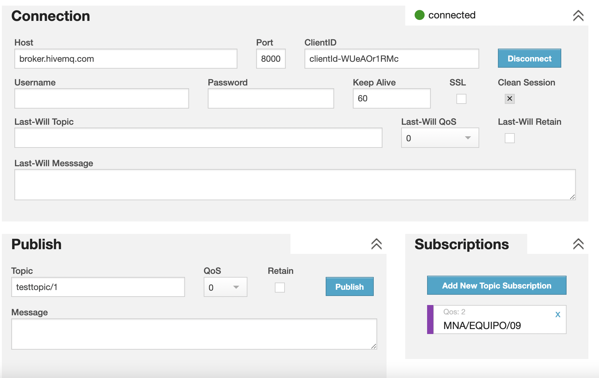

# Ejemplo de Mqtt con Python Para IoT MNA

## Como usar este repositorio
1. Debemos de abrir el notebook donde se publicarán las los datos al broker de la siguiente con el picando el botón de `Open In Colab`

    <a href="https://colab.research.google.com/github/Alex980102/mqtt_MNA_A4/blob/main/pub_mqtt.ipynb">
      
    </a>
2. Para iniciar el proyecto solo debemos de dar click en Entorno de ejecución > Ejecutar todo


3. Usar un cliente para poder recibir los mensajes. Para este apartado podemos usar las siguientes opciones:
    - Abrir el cliente generado desde colab
    <a href="https://colab.research.google.com/github/Alex980102/mqtt_MNA_A4/blob/main/client_mqtt.ipynb">
  
</a>
    - Abrir un cliente propocionado por [Hivemq](http://www.hivemq.com/demos/websocket-client/)
    para esta opción la configuración por defecto sería la siguiente
    

## Notas importantes
- Para cambiar el tag se puede hacer de dos maneras
  1. Cambiando globalmente desde el archivo `.env`
  2. modificando la variable `tag` que se encuentra de esta manera
      ```py
      tag = os.environ.get('TAG')
      ```
      a la siguiente:
      
      ```py
      tag = 'insertar_tag'
      ```

